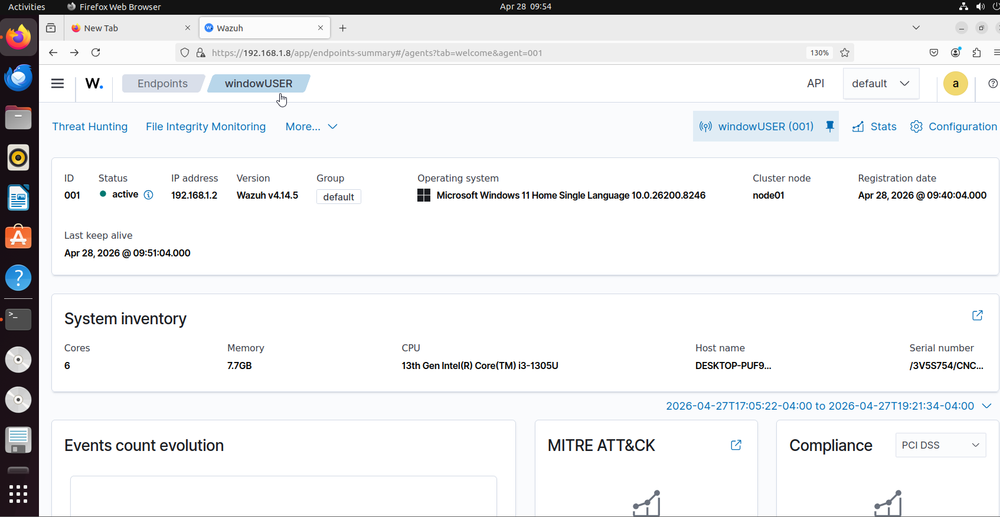
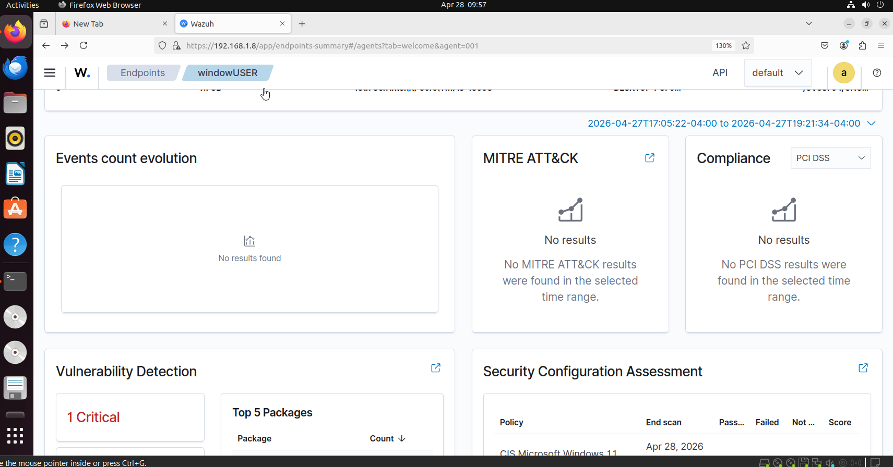
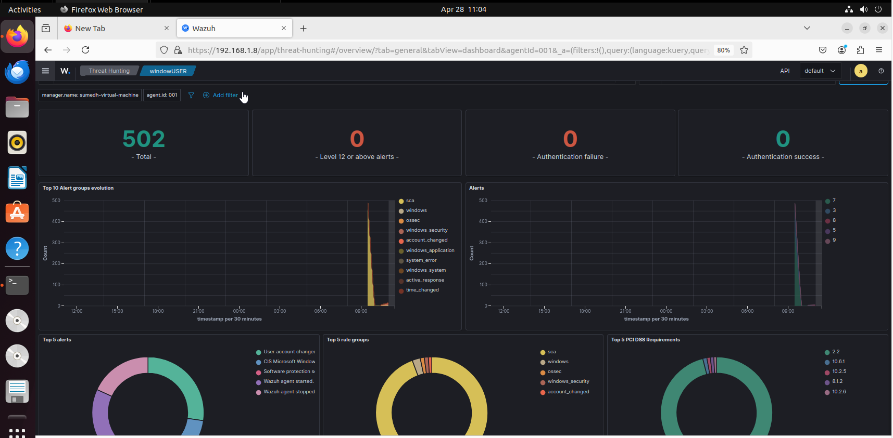
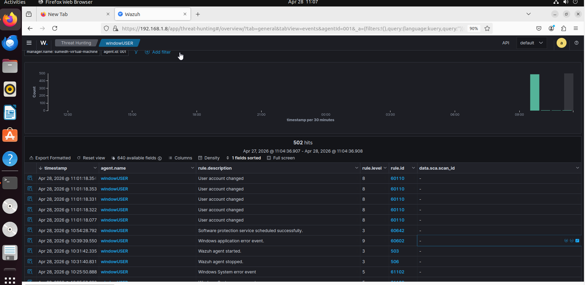
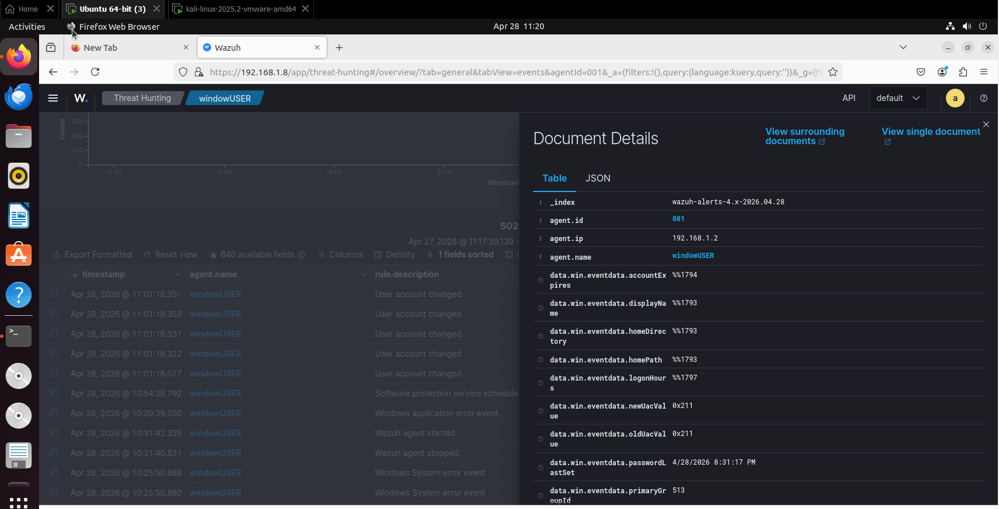
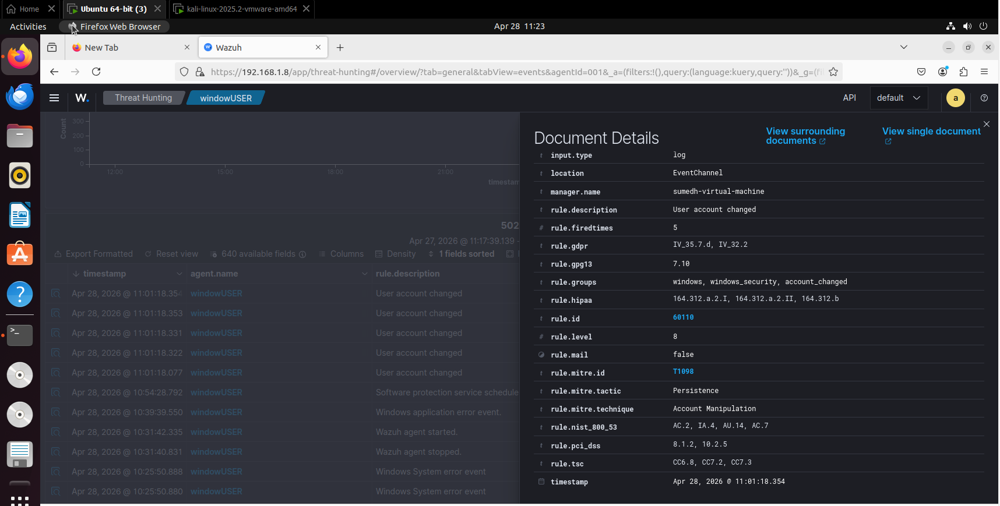

# 🛡️ Wazuh SIEM Home Lab — SOC Analyst Project

> **SOC Home Lab** — Deployed Wazuh SIEM v4.14.5 on Linux, monitored a Windows 11 endpoint, simulated real attacker behavior, detected MITRE ATT&CK T1098 (Account Manipulation), and mapped findings to PCI DSS, HIPAA, GDPR, and NIST 800-53.

---

## 📌 Project Summary

| Field | Details |
|---|---|
| **Project Type** | SOC Home Lab / Blue Team |
| **SIEM Platform** | Wazuh v4.14.5 |
| **Monitored Endpoint** | Windows 11 Home (10.0.26200.8246) |
| **Attack Machine** | Kali Linux 2025.2 |
| **Total Events Collected** | 502 |
| **Key MITRE Technique** | T1098 — Account Manipulation (Persistence) |
| **Lab Date** | April 2026 |

---

## 🖥️ Lab Environment
**Wazuh Server (Ubuntu Linux)** — 192.168.1.8
↕ monitors
**Windows 11 Endpoint (windowsUSER)** — 192.168.1.2 | Agent ID: 001
↑ attacked by
**Kali Linux 2025.2** — Nmap port scan

---
## 📸 Screenshots

### Agent Overview — Windows 11 Endpoint Active

### Vulnerability Detection & Security Assessment

### Threat Hunting Dashboard — 502 Events

### Event Log — Alert Timeline

### Document Details — T1098 Event Data

### Rule Mapping — MITRE & Compliance Frameworks

## ⚙️ Setup & Configuration

### Wazuh Server
- Installed Wazuh v4.14.5 on Ubuntu Linux VM
- Accessible via browser at `https://192.168.1.8`
- Cluster node: `node01`

### Windows 11 Agent
- Deployed Wazuh agent on Windows 11 endpoint
- Agent Name: `windowsUSER` | Agent ID: `001`
- Status: **Active**
- Registration Date: Apr 28, 2026 @ 09:40:04

### System Inventory
| Component | Details |
|---|---|
| CPU | 13th Gen Intel Core i3-1305U |
| RAM | 7.7 GB |
| Cores | 6 |
| OS | Windows 11 Home Single Language |

---

## 📊 Monitoring Results

### Event Overview
| Metric | Value |
|---|---|
| Total Events | **502** |
| Level 12+ Critical Alerts | 0 |
| Authentication Failures | 0 |
| Monitoring Period | Apr 27 – Apr 28, 2026 |

### Top Alert Log
| Timestamp | Event | Level | Rule ID | MITRE |
|---|---|---|---|---|
| Apr 28 @ 11:01:18 | **User account changed** | **8** | 60110 | **T1098** |
| Apr 28 @ 10:39:39 | Windows application error | 9 | 60602 | — |
| Apr 28 @ 10:25:50 | Windows System error event | 5 | 61102 | — |
| Apr 28 @ 10:54:28 | Software protection scheduled | 3 | 60642 | — |
| Apr 28 @ 10:31:42 | Wazuh agent started | 3 | 503 | — |

---

## 🔍 Key Finding — MITRE ATT&CK T1098

### What Was Detected
Rule **60110** fired **5 times** — "User account changed" at severity level **8**.

### MITRE Mapping
| Field | Value |
|---|---|
| **Technique ID** | T1098 |
| **Technique Name** | Account Manipulation |
| **Tactic** | Persistence |
| **Rule Level** | 8 (Medium-High) |
| **Times Fired** | 5 |

### What T1098 Means
After gaining access to a system, attackers modify user accounts to **maintain persistent access** — even if passwords are changed. This is a real-world post-exploitation technique used by threat actors.

### SOC Analyst Response (What I Would Do)
1. Identify which account was modified and by whom
2. Check if the change was authorized (change management records)
3. Cross-reference with authentication logs
4. If unauthorized — escalate as potential insider threat or compromised account
5. Isolate endpoint if needed

---

## 📋 Compliance Mapping

Wazuh automatically mapped the detected alerts to the following frameworks:

| Framework | Controls Triggered |
|---|---|
| **PCI DSS** | 8.1.2, 10.2.5 |
| **HIPAA** | 164.312.a.2.I, 164.312.a.2.II, 164.312.b |
| **GDPR** | IV_35.7.d, IV_32.2 |
| **NIST 800-53** | AC.2, IA.4, AU.14, AC.7 |
| **GPG13** | 7.10 |

---

## ⚔️ Attack Simulation — Kali Linux

| Field | Details |
|---|---|
| Tool Used | Nmap |
| Target | 192.168.1.2 (Windows 11) |
| Firewall | Disabled (lab testing) |
| Result | Partial — Nmap detection gap identified |

> **Honest Note:** The Nmap scan from Kali did not fully trigger Wazuh alerts in this iteration. This is a documented gap — future improvement will include custom rules to detect network scanning activity.

---

## 🛠️ Tools Used

| Tool | Purpose |
|---|---|
| Wazuh v4.14.5 | SIEM / XDR platform |
| Ubuntu Linux | Wazuh server OS |
| Windows 11 | Monitored endpoint |
| Kali Linux 2025.2 | Attack simulation |
| Nmap | Network scanning |
| VMware | Virtualization |

---

## 💡 Skills Demonstrated

- ✅ SIEM deployment and configuration (Wazuh)
- ✅ Windows endpoint agent deployment
- ✅ Log collection and alert triage
- ✅ MITRE ATT&CK framework mapping
- ✅ Compliance framework mapping (PCI DSS, HIPAA, GDPR, NIST)
- ✅ Threat simulation using Kali Linux + Nmap
- ✅ SOC analyst incident response thinking

---

## 🔮 Future Improvements

- [ ] Write custom Wazuh rule to detect Nmap scans
- [ ] Enable Windows Firewall and retest detection
- [ ] Simulate brute-force login → trigger authentication failure alerts
- [ ] Add Linux endpoint for cross-platform monitoring
- [ ] Integrate with TheHive for incident response workflow

---

## 👤 Author

**Sumedh Piyalkar**
Cybersecurity Fresher | SOC Analyst (Blue Team)
📍 Mumbai, India

---

*This project was built as part of my cybersecurity portfolio to demonstrate practical SOC analyst skills.*
